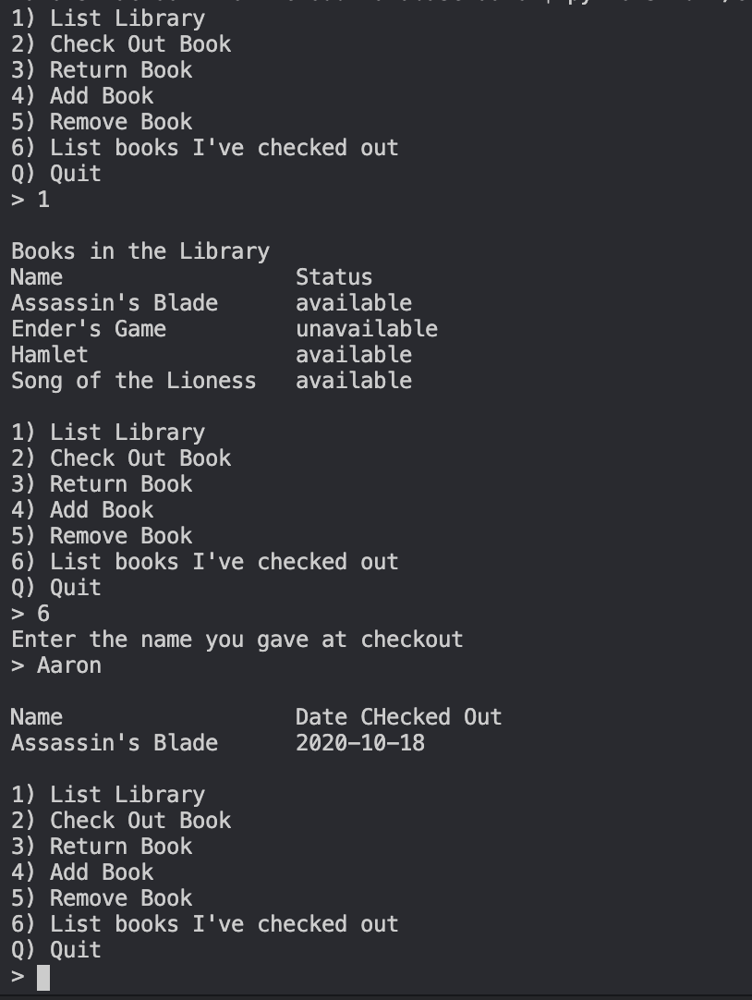
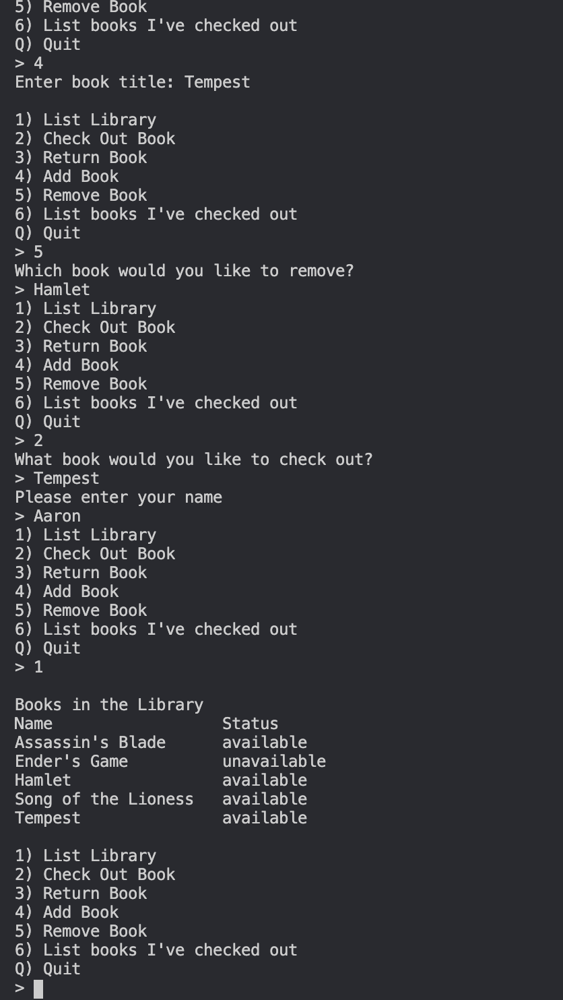

# Description
This program simulates a library book management database.  It allows for simple checkout and return as well as adding and removing entire books from the database.

# Execution
`python3 -u path/to/file/lib.py`

You will need to install firebase to run the program properly
`pip install firebase-admin`

# Useful Sites

https://firebase.google.com/docs/guides
